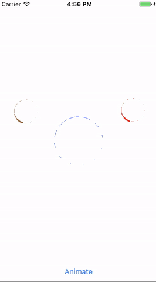

# InstaActivity
Instagram-like activity indicator, pure swift 3 version.

## Installation

### Manually
Drag the files from the Shared folder into your project.

### Usage
Use use InstActivity as your activity indicator while uploading something

## Requirements
- Swift 3
- Xcode 8+

## License
Released under the MIT license. See the LICENSE file for more info.

